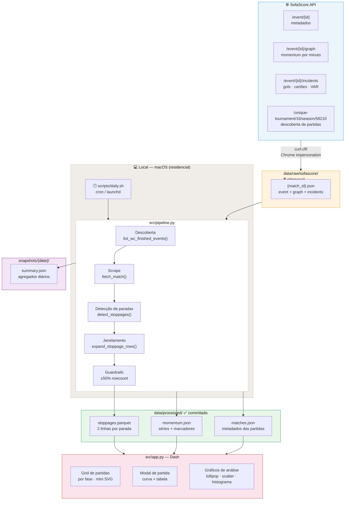

# WC Rafael — WC2026 Stoppage Momentum

Análise do momentum das seleções na Copa do Mundo 2026 durante pausas de hidratação e paradas do VAR.

**Fonte de dados:** SofaScore exclusivamente.

## Arquitetura



## Quickstart

```bash
uv sync --extra dev       # instala dependências + pytest
uv run pytest             # testes offline
uv run python -m src.pipeline --discover-days 3 --date $(date +%Y-%m-%d)
uv run python src/app.py  # app web em http://localhost:8050
```

## Estrutura

```
src/scrape/sofascore.py   — scraper SofaScore (discovery + fetch + parse)
src/parse/stoppages.py    — detecção de paradas (hidratação, VAR, lesão)
src/features/             — janelamento 5 min pré/pós momentum
src/analysis/             — estatísticas descritivas + IC bootstrap
src/viz/charts.py         — builders Plotly + mini-SVG dos cards
src/app.py                — aplicação Dash (gráficos interativos)
scripts/daily.sh          — runner diário (macOS, cron/launchd)
```

## Script diário (macOS)

```bash
# Execução manual
uv run python -m src.pipeline --discover-days 1 --date $(date +%Y-%m-%d)

# Cron (todo dia às 09:00)
0 9 * * * cd /caminho/para/wc-rafael && uv run python -m src.pipeline \
  --discover-days 1 --date $(date +%Y-%m-%d) >> logs/daily.log 2>&1
```
